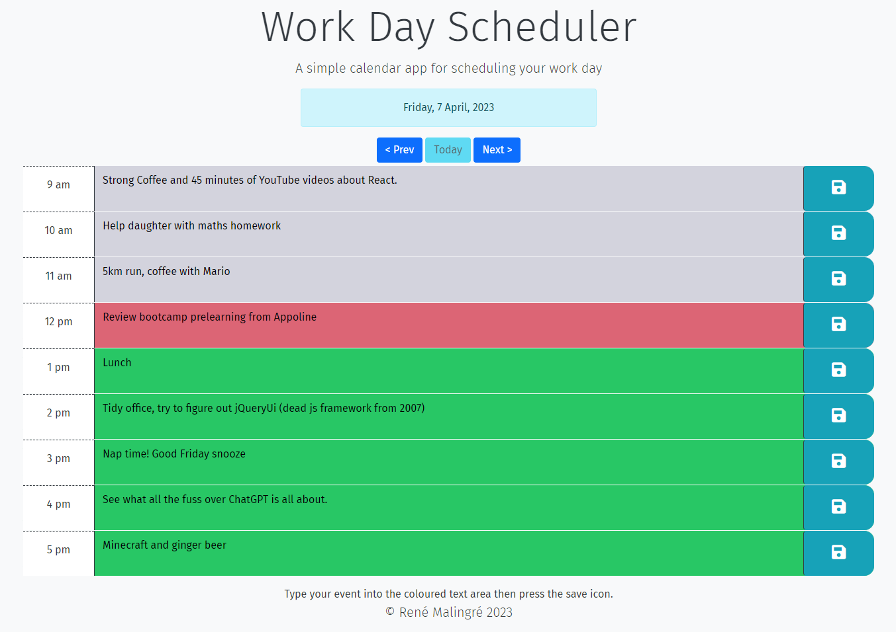
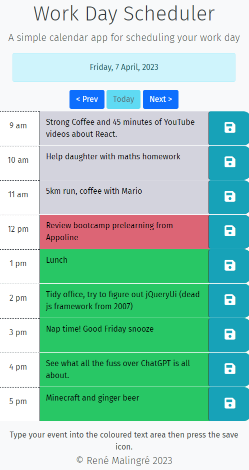
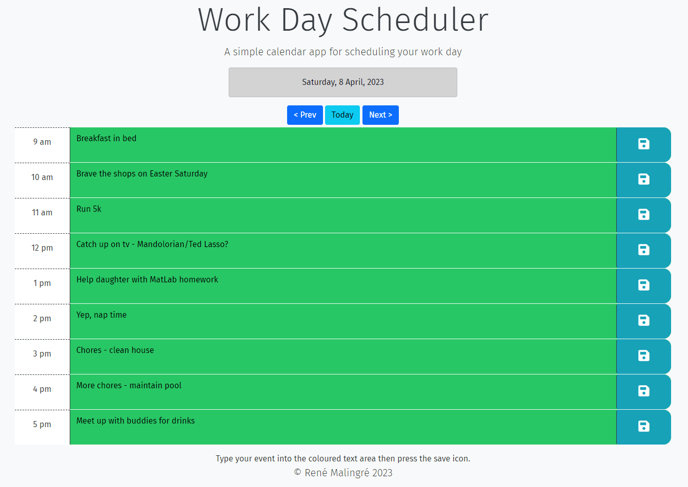
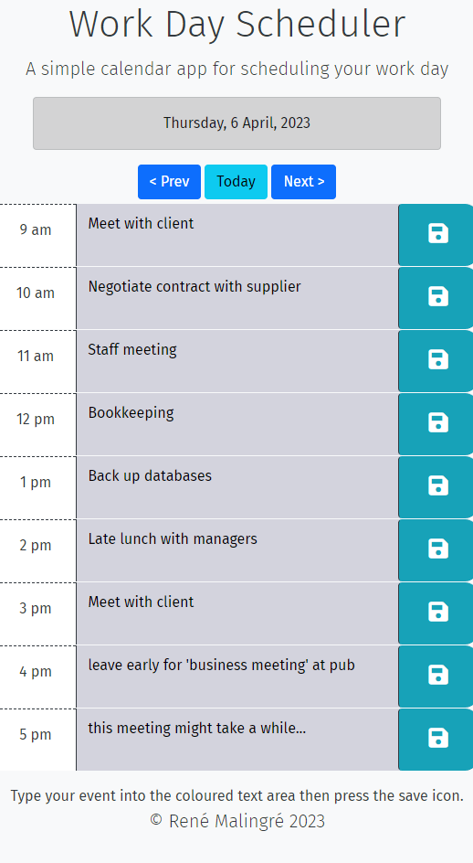

# Simple Day Scheduler

This web application is a simple calendar application that allows a user to save events for each hour of the typical work day (9 am to 6 pm).

## Table of Contents

- [Features](#features)
- [Installation and Usage](#installation-and-usage)
- [Technologies Used](#technologies-used)
- [Screenshots](#screenshots)
- [Live URL and Repository](#live-url-and-repository)
- [Credits](#credits)
- [Contributing](#contributing)
- [License](#license)

## Features

 This app will run in the browser and features dynamically updated HTML and CSS powered by jQuery, Bootstrap and Javascript. It utilises the Day.js library to work with date and time. It saves events in local storage so that the events persist when the user refreshes the page.

 The user is presented with the current day at the top of the calendar. Below that, the user is presented with 1-hour time blocks for standard business hours (9 am to 6 pm). Each time block is colour coded to indicate whether it is in the past, present, or future. The user can enter an event in the text area and click the save button to save the event to local storage. The user can then refresh the page and the event will still be there. The user can navigate to dates in the future or past by clicking the `Prev` or `Next` buttons, or return to the current date by pressing the `Today` button.

## Installation and Usage

Clone the repository to your local machine and open the `index.html` file in your browser to view the quiz application, or go to the [live site](#live-url-and-repository).

1. Open the application in your web browser.
2. The Day Scheduler defaults to the current day.
3. Navigate the your day of interest using the `Prev` or `Next` buttons, or return to the current day by pressing the `Today` button.
4. Enter an event in the text area and click the save button to save the event to local storage.
5. The events entered will be saved to local storage and will persist when the user refreshes the page.

## Technologies Used

- HTML
- CSS
  - CSS Variables
- Bootstrap CSS Framework
  - Grid System
  - Responsive Design
  - Components
- JavaScript
  - DOM Manipulation
  - Event Listeners
  - Event Handlers
  - Local Storage
  - Functions
  - Classes
- Day.js
  - Date and Time Library
- jQuery
  - DOM Manipulation

## Screenshots

### Desktop Browser - Showing the colour coded time blocks

### Mobile Browser

### Desktop Browser - Future Date

### Desktop Browser - Past Date

## Live URL and Repository

The live application can be accessed at the following URL: [Rene's Simple Day Scheduler](https://renemalingre.github.io/renes-simple-day-scheduler/)

The repository can be accessed at the following URL: [Rene's Simple Day Scheduler Repository](https://github.com/ReneMalingre/renes-simple-day-scheduler)

## Credits

- Google Fonts for the typeface - [Fira Sans](https://fonts.google.com/specimen/Fira+Sans)

- Help from Mozilla [MDN Web Docs](https://developer.mozilla.org/) and OpenAI's [ChatGPT](https://chat.openai.com/chat) for providing insights into JavaScript, Bootstrap, jQuery and Day.js.

- Normalize.css v8.0.1 for the CSS reset: [Normalize.css](https://necolas.github.io/normalize.css/)

- Bootstrap v5.1.3 for the CSS framework: [Bootstrap](https://getbootstrap.com/)

- Day.js v1.11.7 for the date and time library: [Day.js](https://day.js.org/)

- jQuery v3.6.4 for the JavaScript library: [jQuery](https://jquery.com/)

## Contributing

Contributions to this project will not be accepted, as this project is an assessment piece for a coding course, and it must be the project author's own work. However, feel free to fork the repository and make your own changes.

## License

This project is licensed under the terms of the MIT license.

© 2023 René Malingré
